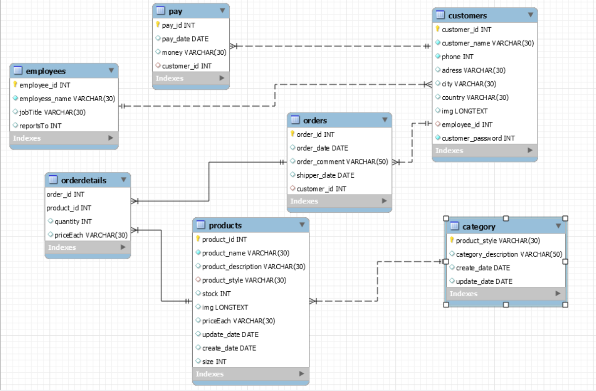

<<<<<<< HEAD
<<<<<<< HEAD
# Module 2
=======
=======
>>>>>>> ef343c0363f54852932f5337e46254882a5b3fd4
# Module 2
# CaseStudy: ...
CHỦ ĐỀ : Một website và trang admin cùng database về một shop bán giày nam, nữ.
Gồm 3 phần chính:
1. Database dữ liệu được lưu lại trên mysql workbench:
- Sẽ kết nối với trang Admin để chủ shop có thể thêm, sửa, xóa sản phẩm và xem doanh thu cũng như những order của khách hàng đặt online và đưa dữ liệu ngược về database.
- Sẽ kết nối với trang web chính bán hàng để khách hàng có thể xem, chọn sản phẩm và tạo đơn order về database và trang darkboard.
<<<<<<< HEAD

2. Trang quản lí darkboard để chủ shop và nhân viên cửa hàng có thể đăng nhập vào.
=======
.
2. Trang quản lí darkboard để chủ shop và nhân viên cửa hàng có thể đăng nhập vào:
>>>>>>> ef343c0363f54852932f5337e46254882a5b3fd4
- Có phần login đăng nhập theo tài khoản được tạo trước, nhân viên sẽ chỉ được xem tồn kho sản phẩm và xử lí những order của khách, chỉ có tài khoản admin của chủ shop mới có thể thêm, sửa, xóa sản phẩm và tạo tài khoản nhân viên.
- Quản lí category, product, user, customers, ...
- Có sử dụng HTML, CSS, PHP, JS và Bootstrap4 để viết trang.
- Ngoài ra có thể phát triển thêm một vài tính năng như xem view sản phẩm, ...
<<<<<<< HEAD
3. Trang chủ nơi khách hàng xem sản phẩm.
- Nơi khách hàng có thể vào xem sản phẩm, xem thông tin của hàng, liên hệ với nhân viên, để lại thông tin, tạo đơn, chọn sản phẩm vào giỏ hàng và thêm, bớt sản phẩm ở đó.
- Gồm Navbar, Slidebar, top giày bán chạy, top giày mới về, các bài viết liên quan đến giày, footer, giỏ hàng, tìm kiếm, các trang chi tiết sản phẩm ...
- Có sử dụng HTML, CSS, PHP, JS và Bootstrap4 để viết trang.
>>>>>>> 0f67cf82308ee22c9c2bef33ac93dc761efaa481
=======
3. Trang chủ nơi khách hàng xem sản phẩm:
- Nơi khách hàng có thể vào xem sản phẩm, xem thông tin của hàng, liên hệ với nhân viên, để lại thông tin, tạo đơn, chọn sản phẩm vào giỏ hàng và thêm, bớt sản phẩm ở đó.
- Gồm Navbar, Slidebar, top giày bán chạy, top giày mới về, các bài viết liên quan đến giày, footer, giỏ hàng, tìm kiếm, các trang chi tiết sản phẩm ...
- Có sử dụng HTML, CSS, PHP, JS và Bootstrap4 để viết trang.
>>>>>>> ef343c0363f54852932f5337e46254882a5b3fd4
